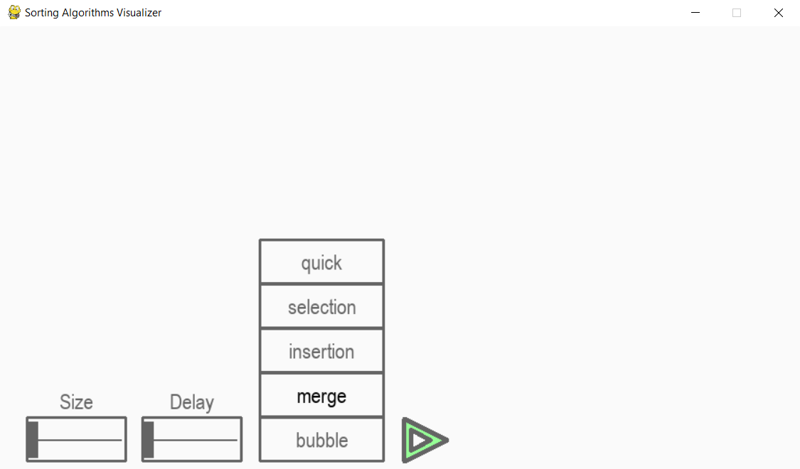

# Sorting Visualizer
•	Created a GUI based application using Pygame package in python that visualizes five different sorting algorithms 
•	The application allows to user to select the algorithm and speed of visualization to compare the execution time of different algorithms 
•	Implemented multiple sorting algorithms: Bubble Sort, Selection Sort, Insertion Sort, Merge Sort, and Quick Sort 

**Merge Sort:-**

**Quick Sort:-**

**Bubble Sort:-**

